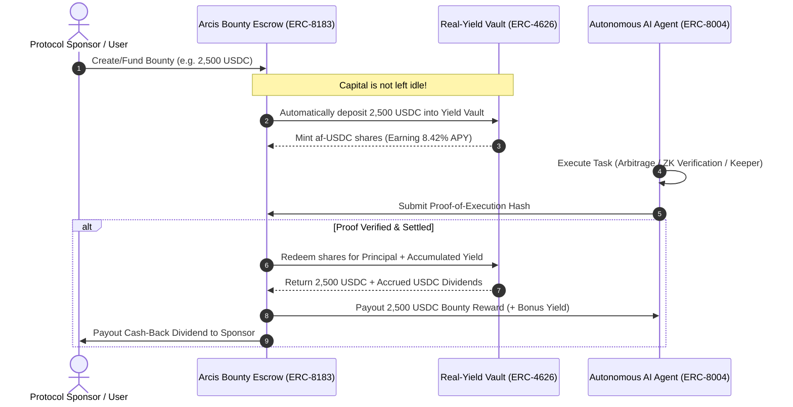

<div align="center">

# 🌊 Arcis Protocol
### Next-Generation Stablecoin Liquidity, Real-Yield Vaults & AI Agentic Settlement on Arc L1

[-0052FF?style=for-the-badge&logo=ethereum&logoColor=white)](https://testnet.arcscan.app)
[](https://docs.arc.io)
[](https://eips.ethereum.org)
[](https://soliditylang.org)
[](https://book.getfoundry.sh)
[](LICENSE)

<p align="center">
  <strong>Arcis</strong> is a high-performance decentralized finance (DeFi) protocol and liquidity engine purpose-built for <strong>Arc</strong> — Circle's Layer-1 blockchain where <strong>USDC is the native gas token</strong> with sub-second deterministic finality.
</p>

<p align="center">
  <a href="#-executive-summary">Executive Summary</a> •
  <a href="#-core-architecture--mechanisms">Core Mechanisms</a> •
  <a href="#-smart-contracts--verified-deployments">Smart Contracts</a> •
  <a href="#-liquidity-pools--vault-catalog">Pools & Vaults</a> •
  <a href="#-erc-8183--erc-8004-ai-agent-hub">AI Agent Hub</a> •
  <a href="#-cross-chain-gateway-engine">Circle Gateway</a> •
  <a href="#-getting-started--deployment">Deployment</a>
</p>

---

</div>

## 📌 Executive Summary

Modern DeFi is hindered by volatile gas tokens, slow cross-chain bridges, impermanent loss, and inflationary "farm-and-dump" reward tokens. **Arcis** completely reimagines on-chain capital efficiency and user experience by leveraging Arc's native USDC architecture and Circle's cross-chain stack.

```
                                  ╔═════════════════════════════════════════╗
                                  ║          Arcis Unified Interface        ║
                                  ╚═════════════════════════════════════════╝
                                                       │
         ┌─────────────────────┬───────────────────────┼───────────────────────┬─────────────────────┐
         ▼                     ▼                       ▼                       ▼                     ▼
 ┌───────────────┐     ┌───────────────┐       ┌───────────────┐       ┌───────────────┐     ┌───────────────┐
 │ 🌐 Unified    │     │ 💱 Stable &   │       │ 🏦 Real-Yield │       │ 🤖 AI Agent   │     │ ⚡ Cross-Chain │
 │    Balance    │     │    AMMs Pools │       │    Vaults     │       │    Escrows    │     │    Routing    │
 │ (13+ Chains)  │     │ (Zero IL / CP)│       │  (ERC-4626)   │       │  (ERC-8183)   │     │ (Gateway/Memo)│
 └───────────────┘     └───────────────┘       └───────────────┘       └───────────────┘     └───────────────┘
         │                     │                       │                       │                     │
         └─────────────────────┴───────────────────────┼───────────────────────┴─────────────────────┘
                                                       │
                                  ╔═════════════════════════════════════════╗
                                  ║       Arc L1 Native USDC Engine         ║
                                  ║   (Sub-Second Finality • Zero ETH Gas)  ║
                                  ╚═════════════════════════════════════════╝
```

### 🌟 Key Innovations
1. **Gas-Abstracted with Native USDC**: No ETH or native gas tokens needed. All transactions and gas fees on Arc are executed natively in USDC (`0x3600...0000`).
2. **Real-Yield ERC-4626 Vault**: Zero token inflation. 90% of all platform transaction fees (Send, Swap, Bridge) flow directly to the `YieldVault` in pure USDC dividends.
3. **Yield-Generating AI Agent Escrow (ERC-8183 & ERC-8004)**: Idle task escrow funds are staked into the ERC-4626 vault during agent execution, providing cash-back yields to sponsors and bonuses to autonomous agents.
4. **Sub-Second Multi-Chain Gateway**: Instant (<500ms) cross-chain liquidity aggregation across 13+ testnet networks powered by Circle Gateway's burn-and-mint architecture.
5. **Dual-AMM Architecture**: Constant-Sum ($x + y = k$) for zero-slippage FX pairs (USDC/EURC) and Constant-Product ($x \cdot y = k$) for volatile assets (USDC/cirBTC).
6. **On-Chain Memos & Privacy Sector**: Native payment memos with invoice hashes (`Memo.sol`) and Arc Privacy Sector (APS) post-quantum encryption compatibility.

---

## 🏛️ Core Architecture & Mechanisms

```mermaid
flowchart TB
    subgraph ClientLayer["Frontend & Auth Layer"]
        UI["Arcis React 18 / Vite DApp"]
        Wagmi["Wagmi / Viem Web3 Connectors"]
        UCW["Circle User-Controlled Wallets (Social / WebAuthn / OTP)"]
        UI --> Wagmi
        UI --> UCW
    end

    subgraph ArcL1["Arc Layer-1 Blockchain (Chain ID: 5042002)"]
        NativeGas["Native USDC Gas Engine (18 Dec Native / 6 Dec ERC-20)"]
        
        subgraph AMMLayer["Automated Market Makers (AMM)"]
            StablePool["StableSwapPool (USDC / EURC)<br/>x + y = k (0.12% Fee)"]
            CPPool["ConstantProductPool (USDC / cirBTC)<br/>x * y = k (0.25% Fee)"]
            FaucetPool["Test Pool (USDC / tcirBTC)<br/>Mintable Faucet Integration"]
        end

        subgraph VaultLayer["Yield & Treasury"]
            YieldVault["YieldVault.sol (ERC-4626)<br/>af-USDC Share Token"]
            Treasury["Protocol Treasury & Fee Distributor"]
            YieldVault <-->|Real USDC Compounding| Treasury
        end

        subgraph AgentLayer["Agentic Economy (ERC-8183 / ERC-8004)"]
            BountyHub["Agent Bounty & Job Escrow"]
            SentinelAgents["Autonomous Agents (Arbitrage / Provers / Keepers)"]
            BountyHub -->|Stake Idle Escrow| YieldVault
            SentinelAgents -->|Submit Proof-of-Work| BountyHub
        end

        subgraph UtilityLayer["On-Chain Metadata & Privacy"]
            MemoContract["Memo.sol (0x5294...)<br/>Invoice Refs & Payment Hashing"]
            APS["Arc Privacy Sector (APS)<br/>Post-Quantum Stealth Masking"]
        end
    end

    subgraph CrossChainLayer["Cross-Chain Interoperability"]
        Gateway["Circle Gateway (<500ms Instant Burn/Mint)"]
        CCTP["Circle CCTP v2 (Native Canonical Bridge)"]
        MultiChains[("13+ Connected Networks:<br/>Sepolia, Base, Arbitrum, Optimism,<br/>Polygon, Avalanche, Solana, Sonic...")]
        Gateway <--> MultiChains
        CCTP <--> MultiChains
    end

    ClientLayer ==> ArcL1
    ArcL1 <==> CrossChainLayer
    AMMLayer -->|Protocol Fee Share (90%)| Treasury
```

---

## 📜 Smart Contracts & Verified Deployments

All contracts are compiled with Solidity `0.8.24` via Foundry and deployed to **Arc Testnet (Chain ID: 5042002)**.

| Contract | Type / Standard | Arc Testnet Address | Explorer |
|---|---|---|---|
| **Native USDC** | Gas Token & ERC-20 | `0x3600000000000000000000000000000000000000` | [ArcScan](https://testnet.arcscan.app/address/0x3600000000000000000000000000000000000000) |
| **EURC** | Circle Euro Coin (ERC-20) | `0x89B50855Aa3bE2F677cD6303Cec089B5F319D72a` | [ArcScan](https://testnet.arcscan.app/address/0x89B50855Aa3bE2F677cD6303Cec089B5F319D72a) |
| **cirBTC** | Circle Wrapped Bitcoin | `0xf0C4a4CE82A5746AbAAd9425360Ab04fbBA432BF` | [ArcScan](https://testnet.arcscan.app/address/0xf0C4a4CE82A5746AbAAd9425360Ab04fbBA432BF) |
| **tcirBTC** | Mintable Test cirBTC (Faucet) | `0x6a32d40a9f9aca0c2b244c53d7c35c0dffbbb8d2` | [ArcScan](https://testnet.arcscan.app/address/0x6a32d40a9f9aca0c2b244c53d7c35c0dffbbb8d2) |
| **StableSwapPool** | Constant-Sum AMM ($x+y=k$) | `0x6d8fda7557d1c0a945a955557e10a4e70a129d20` | [ArcScan](https://testnet.arcscan.app/address/0x6d8fda7557d1c0a945a955557e10a4e70a129d20) |
| **ConstantProductPool** | Real cirBTC AMM ($x \cdot y=k$) | `0x179c9d7f75b0aee8ffe9451fec060b9639220fe6` | [ArcScan](https://testnet.arcscan.app/address/0x179c9d7f75b0aee8ffe9451fec060b9639220fe6) |
| **ConstantProductPool (Test)** | tcirBTC Test AMM | `0x24f09544f554b26c44cf309cfafe448a1a9d3c1f` | [ArcScan](https://testnet.arcscan.app/address/0x24f09544f554b26c44cf309cfafe448a1a9d3c1f) |
| **YieldVault** | ERC-4626 Real-Yield Vault | `0x4a4f0c1dd34c5433a228cbc3a499fabf18e3156d` | [ArcScan](https://testnet.arcscan.app/address/0x4a4f0c1dd34c5433a228cbc3a499fabf18e3156d) |
| **Memo Contract** | On-Chain Metadata Router | `0x5294E9927c3306DcBaDb03fe70b92e01cCede505` | [ArcScan](https://testnet.arcscan.app/address/0x5294E9927c3306DcBaDb03fe70b92e01cCede505) |
| **Protocol Treasury** | Revenue Distribution Hub | `0x4a4f0c1dd34c5433a228cbc3a499fabf18e3156d` | [ArcScan](https://testnet.arcscan.app/address/0x4a4f0c1dd34c5433a228cbc3a499fabf18e3156d) |

---

## 🔬 Mathematical & Economic Models

### 1. StableSwap Invariant ($x + y = k$)
For pegged stablecoin foreign exchange (e.g. USDC/EURC), Arcis implements a constant-sum model with fixed fee deductions:
$$\Delta y = \Delta x \cdot (1 - \phi)$$
where $\phi = 0.0012$ (12 bps). 
* **Zero Impermanent Loss**: Ideal for correlated fiat assets.
* **50/50 Dual Liquidity & 1-Click Zap**: Users can deposit pure USDC, which is automatically balanced and minted as `af-USDC-EURC` LP shares:
$$\text{Shares}_{\text{minted}} = \frac{(\Delta A + \Delta B) \cdot \text{TotalLP}}{R_A + R_B}$$

### 2. Constant-Product AMM ($x \cdot y = k$)
For volatile pairs (USDC/cirBTC and USDC/tcirBTC), Arcis maintains an invariant product curve:
$$(x + \Delta x \cdot (1 - \phi)) \cdot (y - \Delta y) = k$$
where $\phi = 0.0025$ (25 bps). The output amount received is:
$$\Delta y = \frac{y \cdot \Delta x \cdot (1 - \phi)}{x + \Delta x \cdot (1 - \phi)}$$

### 3. ERC-4626 Real Yield Distribution Model
Unlike inflationary reward schemes, `YieldVault.sol` distributes actual USDC cash:
$$\text{Share Price} = \frac{\text{Total Assets (USDC)}}{\text{Total Supply Shares}}$$
When `distributeYield(amount)` is triggered by the protocol revenue router:
$$\text{Net Yield} = \text{Amount} \cdot (1 - \text{PerformanceFee})$$
$$\text{TotalAssets}_{\text{new}} = \text{TotalAssets}_{\text{old}} + \text{Net Yield}$$
This immediately appreciates the redemption value of every minted `af-USDC` share.

---

## 🏊 Liquidity Pools & Vault Catalog

```
Arcis Pools & Vaults Hub
├── 💱 Liquidity Pools (AMM)
│   ├── USDC–EURC Stable Pool        → 6.15% FX APR | Zero IL | 1-Click Zap
│   └── USDC–tcirBTC Test Pool       → 12.80% APR   | Mintable Faucet BTC
├── 🏦 Single-Asset Vault
│   └── USDC Yield Vault (ERC-4626)  → 8.42% APR    | Real USDC Revenue Share
└── 🌐 Cross-Chain Liquidity
    └── Gateway Settlement Pool      → 7.25% APR    | Instant 9+ Chain Settlement
```

| Pool / Vault Name | Category | Risk Profile | Target APR | Yield Source | Key Features |
|---|---|---|---|---|---|
| **USDC / EURC Stable Pool** | Liquidity AMM | 🟢 Safe (Zero IL) | **6.15%** | FX Swap Fees (0.12%) | 1-Click Zap, No Impermanent Loss |
| **USDC / tcirBTC Test Pool** | Practice AMM | 🟡 Medium | **12.80%** | AMM Volume Fees (0.25%) | Built-in Faucet (Mint 0.01 tcirBTC) |
| **USDC Yield Vault** | ERC-4626 Vault | 🔵 Low | **8.42%** | 90% Protocol Revenue Share | Pure USDC Payout, No Lockup |
| **Gateway Settlement Pool** | Cross-Chain | 🔵 Low | **7.25%** | Cross-Chain Routing (0.03%) | <500ms Sub-Second Finality Buffer |

---

## 🤖 ERC-8183 & ERC-8004 AI Agent Hub

Arcis introduces the first **Yield-Generating Escrow Mechanism** for the Agentic Economy on Arc L1.



### Active Autonomous Agents in Arcis:
1. **ArcSentinel-v4** (`0x8004A7...1B89` | Rep: 99): Continuous Multi-Chain FX Arbitrage Sentinel monitoring USDC/EURC rate deviations between Arc Testnet and Base Sepolia.
2. **GatewayProver-01** (`0x8004B9...2B99` | Rep: 97): Sub-second finality verifier ensuring <500ms burn-and-mint settlement across 9 EVM testnets.
3. **FluxOptimizer-AI** (`0x8004C8...8901` | Rep: 95): High-frequency DEX liquidity guard maintaining StableSwap slippage below 0.05%.

---

## 🌐 Cross-Chain Gateway & Multi-Network Engine

Arcis is connected to **13+ blockchain networks** using Circle Gateway's sub-second attestation layer and CCTP v2.

```
                               ┌───────────────────────────┐
                               │  Circle Gateway Hub       │
                               │  (Unified Balance Ledger) │
                               └─────────────┬─────────────┘
                                             │
      ┌────────────────┬─────────────────────┼─────────────────────┬────────────────┐
      ▼                ▼                     ▼                     ▼                ▼
┌───────────┐    ┌───────────┐         ┌───────────┐         ┌───────────┐    ┌───────────┐
│ Arc L1    │    │ Ethereum  │         │ Base      │         │ Arbitrum  │    │ Solana    │
│ Testnet   │    │ Sepolia   │         │ Sepolia   │         │ Sepolia   │    │ Devnet    │
│ (Domain 26│    │ (Domain 0)│         │ (Domain 6)│         │ (Domain 3)│    │ (Domain 5)│
└───────────┘    └───────────┘         └───────────┘         └───────────┘    └───────────┘
```

### Supported Gateway Networks & Testnet Domain IDs:
| Network | Domain ID | Average Settlement | USDC Contract Address |
|---|---|---|---|
| **Arc Testnet** | `26` | **380 ms** | `0x3600000000000000000000000000000000000000` |
| **Ethereum Sepolia** | `0` | 420 ms | `0x1c7D4B196Cb0C7B01d743Fbc6116a902379C7238` |
| **Base Sepolia** | `6` | 390 ms | `0x036CbD53842c5426634e7929541eC2318f3dCF7e` |
| **Arbitrum Sepolia** | `3` | 410 ms | `0x75faf114eafb1BDbe2F0316DF893fd58CE46AA4d` |
| **Optimism Sepolia** | `2` | 430 ms | `0x5fd84259d66Cd46123540766Be93DFE6D43130D7` |
| **Polygon Amoy** | `7` | 450 ms | `0x41e94eb019c0762f9bfcf9fb1e58725bfb0e7582` |
| **Avalanche Fuji** | `1` | 400 ms | `0x5425890298aed601595a70ab815c96711a31bc65` |
| **Solana Devnet** | `5` | 440 ms | `4zMMC9srt5Ri5X14GAgXhaHii3GnPAEERYPJgZJDncDU` |
| **Sonic Testnet** | `13` | 340 ms | `0x0BA304580ee7c9a980CF72e55f5Ed2E9fd30Bc51` |
| **HyperEVM / Sei / Uni / World** | `19 / 16 / 10 / 14` | <400 ms | *Configured in `src/config/gatewayConfig.ts`* |

---

## ⚡ Core Features Walkthrough

### 1. 🌐 Unified Cross-Chain Balance
- Consolidates your USDC holdings across all 13 chains into a single liquid balance.
- Deposit testnet USDC on any chain and spend it instantly on Arc without waiting for manual bridge confirmations.

### 2. 💸 Fast Send with On-Chain Memos & Privacy Masking
- Send USDC natively on Arc with attached 32-byte hash identifiers and UTF-8 memo text via `sendUsdcWithMemo()`.
- Client-side privacy mode (`PrivacyToggle.tsx`) masks sensitive portfolio balances with post-quantum token placeholders (`aps_pq_...`).

### 3. 🔄 Instant Swaps & Bridge Routing
- **Dual Bridge Modes**:
  - **Turbo (Gateway Instant)**: Sub-500ms cross-chain burn-and-mint settlement.
  - **Direct (CCTP v2)**: Canonical Circle cross-chain attestation transfer.
- **Slippage & Custom Recipient Protection**: Built-in MEV protection and configurable tolerance (0.1%, 0.5%, 1.0%).

### 4. 🧮 Multi-Chain Liquidity Rebalance Wizard
- Interactive scanner (`GatewayRebalanceWizard.tsx`) detects idle capital across all EVM networks and performs batch rebalancing to Arc in under 500 milliseconds.

---

## 🛠️ Tech Stack

| Category | Technology |
|---|---|
| **Smart Contracts** | Solidity `0.8.24`, OpenZeppelin Contracts v5, Foundry (`forge`, `cast`) |
| **Blockchain Target** | Arc Testnet (Chain ID: `5042002`, Native Gas: USDC) |
| **Frontend Framework** | React 19, Vite 6, TypeScript 5.6 |
| **Web3 Libraries** | Viem v2, Wagmi v3, TanStack React Query v5 |
| **Circle SDKs** | `@circle-fin/app-kit`, `@circle-fin/unified-balance-kit`, `@circle-fin/user-controlled-wallets`, `@circle-fin/w3s-pw-web-sdk` |
| **Styling & UI** | Tailwind CSS v4, Lucide React, Web3Icons |
| **Backend & Cache** | Express API, Redis Cache (`ioredis`), EIP-712 Signature Handlers |

---

## 🚀 Getting Started & Local Development

### 1. Prerequisites
- [Node.js](https://nodejs.org/) (v18.0.0 or higher)
- [Foundry](https://book.getfoundry.sh/) (`curl -L https://foundry.paradigm.xyz | bash`)
- Arc Testnet USDC ([Get from Circle Faucet](https://faucet.circle.com))

### 2. Clone & Install Dependencies
```bash
# Clone the repository
git clone https://github.com/your-username/arcis-protocol.git
cd arcis-protocol

# Install frontend dependencies
npm install

# Install Foundry contract dependencies
cd contracts
forge install
cd ..
```

### 3. Environment Setup
Create a `.env` file in the root directory:
```env
# Arc Testnet RPC
VITE_ARC_RPC_URL=https://rpc.testnet.arc.io
VITE_ARC_CHAIN_ID=5042002

# Circle API Keys (Optional for UCW & Dev Wallets)
VITE_CIRCLE_API_KEY=your_circle_api_key_here
VITE_CIRCLE_APP_ID=your_circle_app_id_here

# Deployer Private Key (For Foundry scripts)
PRIVATE_KEY=0x_your_private_key_here
```

### 4. Run Development Server
```bash
npm run dev
```
Open your browser and navigate to `http://localhost:5173`.

---

## 🧪 Smart Contract Testing & Deployment

### Run Test Suite (100% Pass)
```bash
cd contracts
forge test -vvv
```
*Executes unit and integration test suites covering `StableSwapPool.t.sol`, `ConstantProductPool.t.sol`, and `YieldVault.t.sol`.*

### Deploy Contracts to Arc Testnet
```bash
cd contracts

# Run Foundry broadcast script
forge script script/Deploy.s.sol \
  --rpc-url https://rpc.testnet.arc.io \
  --chain-id 5042002 \
  --broadcast \
  --slow
```

### Verify Contracts on ArcScan
```bash
forge verify-contract <CONTRACT_ADDRESS> src/StableSwapPool.sol:StableSwapPool \
  --chain-id 5042002 \
  --verifier blockscout \
  --verifier-url https://testnet.arcscan.app/api/
```

---

## 📁 Repository Structure

```
arcis-protocol/
├── contracts/                       # Foundry Smart Contract Suite
│   ├── src/
│   │   ├── StableSwapPool.sol       # Constant-Sum AMM (USDC/EURC)
│   │   ├── ConstantProductPool.sol  # Constant-Product AMM (USDC/cirBTC)
│   │   ├── YieldVault.sol           # ERC-4626 Real Yield Vault
│   │   ├── mocks/MockERC20.sol      # Faucet-enabled Test Token
│   │   └── interfaces/              # Pool & ERC-20 Interfaces
│   ├── test/                        # Solidity Unit & Invariant Tests
│   └── script/Deploy.s.sol          # Arc Testnet Deployment Script
├── src/
│   ├── assets/                      # SVG Icons & Token Graphics
│   ├── components/
│   │   ├── pools/                   # PoolsTab, PoolCard, AgentBountyHubModal,
│   │   │                            # GatewayRebalanceWizard, YieldCalculator
│   │   ├── privacy/                 # APS Privacy Toggles & Encryption Badges
│   │   ├── common/                  # SpeedFeeSelector, UI Components
│   │   ├── Header.tsx               # Top Navigation & UCW Profile
│   │   ├── UnifiedBalance.tsx       # Cross-Chain 13-Network Balance Aggregator
│   │   ├── SendModal.tsx            # USDC Send with Memo & Speed Tiers
│   │   ├── SwapModal.tsx            # AMM & App Kit Swap Interface
│   │   ├── BridgeModal.tsx          # Dual-Engine CCTP / Gateway Bridge
│   │   └── CircleAuthModal.tsx      # Social Login / Passkey WebAuthn
│   ├── config/                      # Arc Chain, Pools, Gateway & Fee Configurations
│   ├── hooks/                       # Web3, Gateway, Pools & Agent State Hooks
│   ├── services/                    # Viem Adapters, Gateway API, Memo & Swap Services
│   └── utils/                       # EIP-712 Encoders, History & Error Handlers
├── api/                             # Express / Redis Backend & Faucet Endpoints
└── README.md                        # Master Documentation
```

---

## 🔒 Security & Best Practices

1. **Native USDC Decimal Alignment**: Arc utilizes 18 decimals for native balance lookups and 6 decimals for ERC-20 interface interactions. Arcis contracts enforce rigorous 6-decimal fixed-point precision across all mathematical curves.
2. **Reentrancy Protection**: Critical state-mutating functions (`addLiquidity`, `removeLiquidity`, `swap`, `redeem`) implement OpenZeppelin's `ReentrancyGuard`.
3. **Nonpayable Guarding**: Explicit `receive()` and `fallback()` functions reject unexpected native transfers to prevent unbacked token lockups.
4. **SafeERC20 Compliance**: All token movements utilize OpenZeppelin `SafeERC20` wrappers to guard against non-standard ERC-20 returns.

---

## 🔗 Useful Links & Resources

- 🌐 **Arc Official Documentation**: [docs.arc.io](https://docs.arc.io)
- 🔍 **ArcScan Explorer**: [testnet.arcscan.app](https://testnet.arcscan.app)
- 💧 **Circle Faucet**: [faucet.circle.com](https://faucet.circle.com)
- 📚 **Circle App Kit Docs**: [developers.circle.com](https://developers.circle.com)
- 🛠️ **Foundry Book**: [book.getfoundry.sh](https://book.getfoundry.sh)

---

## 📄 License

This project is licensed under the **MIT License** — see the [LICENSE](LICENSE) file for details.

<div align="center">
  <sub>Built with ❤️ for the Circle & Arc Blockchain Ecosystem.</sub>
</div>