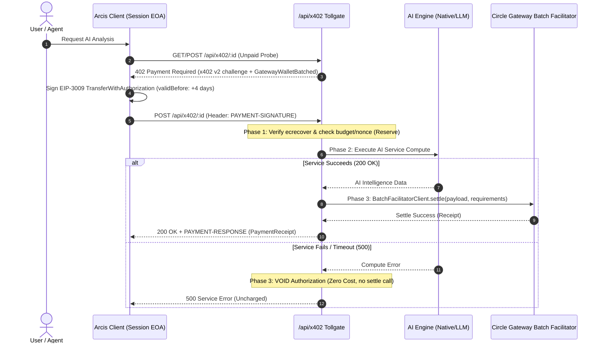

# Arcis AI Services & x402 Gateway Nanopayments Architecture

## 1. Executive Summary & Philosophy

Arcis AI Services Marketplace is designed to provide high-frequency, sub-cent, agentic on-chain intelligence and DeFi automation over **Arc L1** utilizing **Circle Gateway Nanopayments (x402 v2)**.

Instead of traditional subscription lock-ins or cumbersome per-transaction wallet popups, callers (both human traders and autonomous AI agents) pay micro-USDC ($0.002 - $0.008) per invocation via off-chain signed cryptographic authorizations (EIP-3009 TransferWithAuthorization). Transactions are settled atomically and gaslessly via Circle Gateway's batched settlement infrastructure, guaranteeing instant (<500ms) execution without gas friction.

---

## 2. Technical Realities & Constraints

During deep architectural review and prototyping, three immutable technical realities were established:

1. **Vanilla x402 Exact Settlement is Economically Impossible on Arc L1 for Micro-Services:**
   Arc L1 transaction gas (`computeArcGasCostUsdc()`) incurs a minimum baseline of ~**0.0024 USDC** per on-chain transaction (`aiServicesDataProvider.ts:73-84`). Settling calls individually on-chain for 0.002–0.008 USDC micro-services causes gas fees to exceed or consume the service fee. **Circle Gateway Batched Settlement is strictly required.**
2. **Circle Middleware is Express-Oriented; Arcis Architecture is Web-Standard Request/Response:**
   Circle's `createGatewayMiddleware().require(price)` is packaged for Express, whereas Arcis tollgate routes (`api/*.ts`) conform to Web-standard `(Request) => Response` (compatible with Vite SSR dev server and Vercel Serverless Functions). Therefore, the tollgate must directly invoke **`BatchFacilitatorClient.settle(payload, requirements)`** on dynamic manifest prices rather than relying on Express middleware.
3. **Gateway Single `payTo` Recipient Constraint:**
   A single payment requirement in Circle Gateway x402 v2 specifies exactly one recipient address (`payTo`). Multi-party on-the-fly split (e.g., 99% provider / 1% YieldVault) within a single EIP-3009 authorization cannot occur on-chain without an intermediary ledger. Protocol fee collection must be decoupled from micro-invocation settlement.

---

## 3. Architecture Decision Records (ADRs)

### ADR-001: EOA-Only Settlement for EIP-3009 Authorizations
* **Status:** Accepted
* **Context:** Circle Gateway Nanopayments verifies `TransferWithAuthorization` signatures using EVM `ecrecover`. It does not support ERC-1271 contract signatures (`isValidSignature`) for smart contract accounts (SCA).
* **Decision:** The payer entity for x402 nanopayments must be an **EOA** (Externally Owned Account):
  1. `session_eoa`: Ephemeral session key generated in the browser for zero-popup autonomous execution.
  2. `external_eoa`: Connected Web3 browser wallet (MetaMask, Rainbow, Coinbase).
* **Consequence:** The legacy direct MSCA userOperation path for x402 is deprecated in favor of EOA authorizations.

### ADR-002: Passkey (MSCA) User Payment & Ephemeral Session Key Bridge
* **Status:** Accepted (Revised by ADR-004)
* **Context:** Arcis primary user onboarding is Passkey-based (Circle Modular Smart Account - MSCA). MSCAs cannot directly sign EIP-3009 authorizations verified by `ecrecover`.
* **Decision:** Provision an ephemeral in-memory Session EOA for Passkey users, loaded with a user-defined spending cap (session budget).

### ADR-003: Payment Rail — Circle Gateway Nanopayments (x402 v2) vs Vanilla x402 vs Self-Hosted Netting
* **Status:** Accepted
* **Evaluation Matrix:**

| Evaluation Criteria | A) Circle Gateway Nanopayments (x402 v2, batched) | B) Vanilla x402 Exact (Arc USDC EIP-3009, on-chain) | C) Arcis Self-Hosted Facilitator & Netting |
|---|---|---|---|
| **Sub-cent Unit Economics** | **Viable** (min $0.000001, zero gas for buyer & seller) | **Broken** (gas ≥ 0.0024 USDC vs 0.002 USDC service price) | Viable (internal off-chain netting) |
| **Execution Latency** | **<500ms** (instant off-chain authorization check) | Slower (block confirmation + nonce queues) | ~0ms |
| **Buyer Prerequisites** | Single 1-time `deposit()` to Gateway balance | None (standard USDC in wallet) | None |
| **Agent Ecosystem Interop** | Standard (`circle services pay`, `PAYMENT-*` headers) | Custom headers / non-standard facilitator | Proprietary Arcis-only API |
| **EOA Requirement** | Requires EOA (`ecrecover`, no ERC-1271) | Requires EOA (EIP-3009 requires `ecrecover`) | Flexible (Arcis ledger verifies signatures) |
| **Trust & Custody Model** | Protocol-level batching, provable settlement | Trustless direct on-chain transfer | High custody risk (Arcis holds balance sheet) |
| **Implementation Complexity** | Medium (GatewayWalletBatched domain, SDK integration) | Low (direct USDC transferWithAuthorization) | High (accounting, netting, audit, disputes) |

* **Decision:** Adopt **Option A (Circle Gateway Nanopayments x402 v2)** as the primary and default payment rail across all AI micro-services. Maintain Option B strictly as an optional fallback for premium/enterprise services priced at ≥ 0.05 USDC where gas overhead is under 5%. Reject Option C due to custodial and audit overhead.
* **Technical Specifications:**
  - Protocol version: `x402Version: 2`
  - EIP-712 Domain: `{ name: 'GatewayWalletBatched', version: '1', verifyingContract: GATEWAY_CONTRACTS[network].gatewayWallet }`
  - Scheme: `exact` with `extra: { name: 'GatewayWalletBatched', version: '1', verifyingContract: ... }`
  - Headers: Standard `PAYMENT-REQUIRED`, `PAYMENT-SIGNATURE`, `PAYMENT-RESPONSE`

### ADR-004: Passkey/MSCA User Nanopayment Access Model
* **Status:** Accepted
* **Context:** Gateway Nanopayments verifies signatures using `ecrecover(digest, v, r, s) == from`. The depositor in Gateway Nanopayments must match the signer of `TransferWithAuthorization`.
* **Options Considered:**
  1. *Session EOA via `addDelegate`:* Call `GatewayWallet.addDelegate(sessionEoa)`. However, `TransferWithAuthorization` verifies `ecrecover == from`. Delegation in Gateway contracts is specified for cross-chain `BurnIntent` (`sourceDepositor` vs `sourceSigner`), not for standard EIP-3009.
  2. *Session EOA with Funded Budget:* The user's MSCA transfers a small budget (e.g. 2–5 USDC) to an ephemeral Session EOA created in browser memory. The Session EOA deposits to Gateway and signs authorizations autonomously. Unused funds are refundable at any time.
  3. *External EOA Only:* Require MSCA users to connect an external EOA (MetaMask, etc.).
* **Decision:** Adopt **Option 4.2 (Session EOA with Dedicated Budget)** as the production architecture.
  - Ephemeral EOA key is generated in client memory upon initiating an AI session.
  - User approves a single funding transaction from their MSCA into the Session EOA with automated Gateway deposit.
  - Session EOA signs all micro-invocations seamlessly without wallet approval popups.
  - Remaining balance is returned to the user's MSCA upon session close or expiration.

### ADR-005: Ledger Single Source of Truth & Non-Custodial Withdrawals
* **Status:** Accepted
* **Context:** Legacy code held state across three disconnected tiers: client `localStorage` counters, server KV storage (`arcis:x402:provider:*`), and Gateway balances. Furthermore, withdrawals previously lacked signature verification.
* **Decision:**
  - **Kanonik Financial Authority:** Circle Gateway balance (`gateway.getBalances()`) is the **sole source of truth** for real token balances.
  - **Provider Withdrawals:** Providers claim accumulated earnings directly from Circle Gateway using their own cryptographic signature. Arcis never holds, escrows, or intermediates provider funds.
  - **Server KV Role:** Server-side Redis/KV storage is strictly restricted to **usage telemetry, service analytics, idempotency cache, and rate limiting**.
  - **Client localStorage:** `localStorage` is treated strictly as an **ephemeral UI cache** with zero financial authority.

### ADR-006: Seller-of-Record and Protocol Fee Model
* **Status:** Accepted
* **Context:** In x402 v2, each payment requirement has a single `payTo` address. A micro-call of 0.005 USDC cannot be split into 0.00495 USDC (provider) and 0.00005 USDC (YieldVault) per call without doubling settlement latency or requiring Arcis to act as a custodial merchant of record.
* **Decision:** Adopt a **Non-Custodial Direct Provider + Funding-Side Protocol Fee Model (6.2 + 6.3)**:
  1. **Direct to Provider (`payTo` = Provider Address):** 100% of the per-call micro-service price is routed directly to the AI service provider's Gateway address. Arcis never takes custody of service provider payments.
  2. **YieldVault Protocol Contribution:** A nominal protocol fee (e.g. 1%) is assessed transparently at session budget deposit/onboarding time or via provider marketplace registration/listing fees, rather than micro-taxing individual sub-cent invocations.
  3. **UI Transparency:** Marketplace UI messaging is updated from "1% deducted per call" to "100% Direct Provider Pass-Through + YieldVault Liquidity Backing".

---

## 4. Open Verification Items & Resolved Technical Realities

Before proceeding with Phase 2 implementation, all five key architectural questions were investigated against Circle Gateway specifications:

| # | Question | Finding & Resolution | Status |
|---|---|---|---|
| **V1** | **Can `addDelegate` on Gateway allow a session EOA to sign `GatewayWalletBatched` for an MSCA?** | **No.** In Gateway Nanopayments, EIP-3009 `TransferWithAuthorization` verifies `ecrecover(digest) == from`. The Gateway `addDelegate` mechanism is built specifically for cross-chain `BurnIntent` (`sourceDepositor` vs `sourceSigner`). Therefore, **ADR-004 Option 4.2 (Funded Session EOA)** is technically mandatory. | **Resolved (Use 4.2)** |
| **V2** | **Is multi-party `payTo` splitting supported in a single x402 requirement?** | **No.** Each payment requirement in `accepts[]` maps to a single recipient address. Splitting requires an intermediary merchant of record or decoupled protocol fee collection. **ADR-006 (Direct Provider Pass-Through + Deposit Fee)** is confirmed. | **Resolved (Use ADR-006)** |
| **V3** | **Is `amount` in x402 v2 exact or maximum? How is I1 (No Overcharge) guaranteed?** | **Exact.** In EIP-3009, the EIP-712 struct hash includes `value`. Modifying `value` invalidates the signature. In x402 v2, the tollgate challenge returns the exact price for that invocation. Dynamic quotes are delivered via the 402 challenge, and the client signs that exact amount. Overcharging is cryptographically impossible. | **Resolved (Enforced by EIP-712)** |
| **V4** | **Does `BatchFacilitatorClient.settle()` work in Vercel Serverless / SSR environments?** | **Yes.** `@circle-fin/x402-batching/server` is a pure Node.js HTTP client that dispatches REST requests to Circle's facilitator endpoint (`<500ms`). It has no persistent daemon requirements and runs within standard Node.js serverless execution limits. | **Resolved (Fully Supported)** |
| **V5** | **Why does Gateway require `validBefore >= 3–7 days`? What is the impact on replay protection?** | Gateway aggregates micro-authorizations into periodic on-chain settlement batches. Signatures expiring too quickly would fail if batch finalization is delayed. **Replay protection is preserved** because nonces are recorded atomically upon `settle()` in Gateway's off-chain ledger and in Arcis KV idempotency storage (`sha256(serviceId \| payer \| nonce)`). Bounded budget caps on Session EOAs mitigate exposure. | **Resolved (32-byte nonces + KV)** |

---

## 5. Core Architectural Invariants (Revised)

| ID | Invariant | Technical Description & Enforcement |
|---|---|---|
| **I1** | **No Overcharge** | Callers are never charged more than the signed quote. Cryptographically enforced by EIP-712/EIP-3009 hash verification; `BatchFacilitatorClient.settle()` rejects any payload where value diverges from requirement. |
| **I2** | **Idempotent Replay** | Requests with the same `idempotencyKey = sha256(serviceId \| payer \| nonce)` return the previously generated response without re-settlement or duplicate debits. |
| **I3** | **Single Nonce** | Each 32-byte authorization `nonce` is consumed upon settlement. Subsequent submissions fail with `REPLAY_DETECTED`. |
| **I4** | **Two-Phase Settlement (Commit vs Void)** | If AI service execution fails or times out, the authorization is voided. No settlement call is made to Circle Gateway, ensuring zero cost to the user. |
| **I5** | **Ephemeral Key Scoping & Client Isolation** | Session EOA private keys are generated and held exclusively in ephemeral browser memory (`sessionStorage` or React state). Keys are never transmitted to server endpoints and never written to unencrypted persistent storage. Maximum exposure is strictly capped by the user-defined session budget (e.g. 1–5 USDC). |
| **I6** | **Telemetry Integrity** | Real SLA, latency, and uptime metrics are derived strictly from active, verifiable endpoint health probes. Synthetic or RPC fallback measurements are explicitly labeled as `probeTarget: 'rpc'`. |
| **I7** | **Single Source Pricing** | `manifest.pricing.priceUsdc` is the sole source of truth across catalog listings, 402 challenge headers, and client pricing estimators. |

---

## 6. Contract Specifications & Protocols

### 6.1 x402 v2 Payment Requirements Challenge (`PAYMENT-REQUIRED`)
```json
{
  "x402Version": 2,
  "accepts": [
    {
      "scheme": "exact",
      "network": "eip155:5042002",
      "asset": "0x3600000000000000000000000000000000000000",
      "payTo": "0xProviderAddress...",
      "amount": "5000",
      "maxTimeoutSeconds": 345600,
      "extra": {
        "name": "GatewayWalletBatched",
        "version": "1",
        "verifyingContract": "0x0077777d7EBA4688BDeF3E311b846F25870A19B9"
      }
    }
  ]
}
```

### 6.2 Two-Phase Settlement Flow (Reserve → Execute → Commit)


---

## 7. Concrete File Modification Matrix

| File Path | Planned Architecture Updates |
|---|---|
| `src/types/x402.ts` | Update `X402PaymentRequirements` to `x402Version: 2`, `network: 'eip155:5042002'`, `amount` (string base units), `asset` address, `extra` metadata block (`GatewayWalletBatched`). |
| `src/config/x402/schemes.ts` | Add `GATEWAY_BATCHED_DOMAIN` configuration pointing to `GATEWAY_CONTRACTS.testnet.gatewayWallet`; maintain legacy vanilla domain for fallback. |
| `src/config/x402/manifests/*` | Format `accepts[]` to comply with x402 v2 specifications (CAIP-2 network identifiers, exact USDC asset addresses). |
| `api/x402.ts` | Implement direct `BatchFacilitatorClient.settle()` invocation, 4-day `validBefore` allowance, non-custodial provider settlement pass-through, Redis idempotency caching. |
| `src/services/x402/paymentOrchestrator.ts` | Connect to `@circle-fin/x402-batching/client` (`BatchEvmScheme`), eliminate mock transaction hash generators, enforce real 402 challenge retry cycle. |
| `src/services/x402/gatewayClient.ts` | Wrap real Circle Gateway SDK methods for deposits, balance inquiries, and direct withdrawals. |
| `src/services/x402PaymentEngine.ts` | Deprecate `localStorage` financial authority; query Gateway balances dynamically; adapt session budget manager. |
| `package.json` | Add `@circle-fin/x402-batching`, `@x402/core`, `@x402/evm` dependencies. |
| `docs/architecture/ai-services-x402.md` | Keep updated with ADR-001 through ADR-006, resolved verification items, and updated invariant specifications. |

---

## 8. Implementation Roadmap

- **F0: Architectural Contracts & ADR Alignment** *(Completed)*
  - ADR-001 through ADR-006 documented and approved.
  - Type contracts defined in `src/types/x402.ts`.
- **F1: Buyer Session EOA & Batch Scheme Signer**
  - Ephemeral session key generator with budget cap and MSCA funding bridge.
  - Implement `@circle-fin/x402-batching/client` (`BatchEvmScheme`).
- **F2: Tollgate API Dispatcher & Facilitator Settle**
  - Dynamic route handler `/api/x402/:id` invoking `BatchFacilitatorClient.settle()`.
  - Upstash/KV idempotency guard (`sha256(serviceId | payer | nonce)`).
- **F3: Non-Custodial Provider Hub & Gateway Inquiries**
  - Direct balance lookup via Circle Gateway API (`gateway.getBalances()`).
  - Provider self-serve withdrawal signature flow.
- **F4: Live Telemetry Probes & Healthchecks**
  - Automated probing with transparent `probeTarget: 'endpoint' | 'rpc'` reporting.
- **F5: Marketplace Catalog Expansion**
  - Onboard extended categories (Agent & Copilot, Automation, Risk & Compliance).
